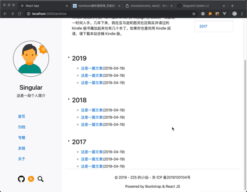
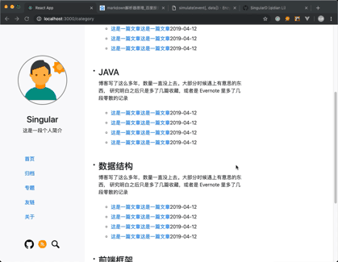
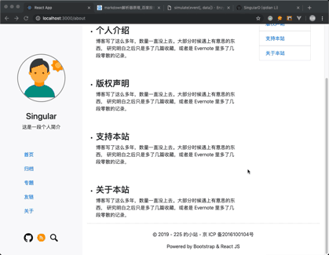
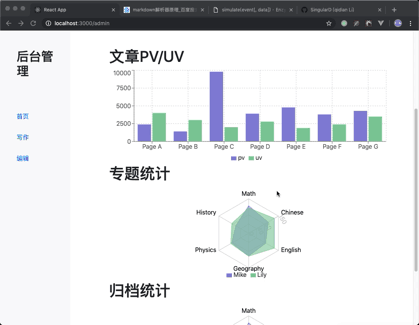
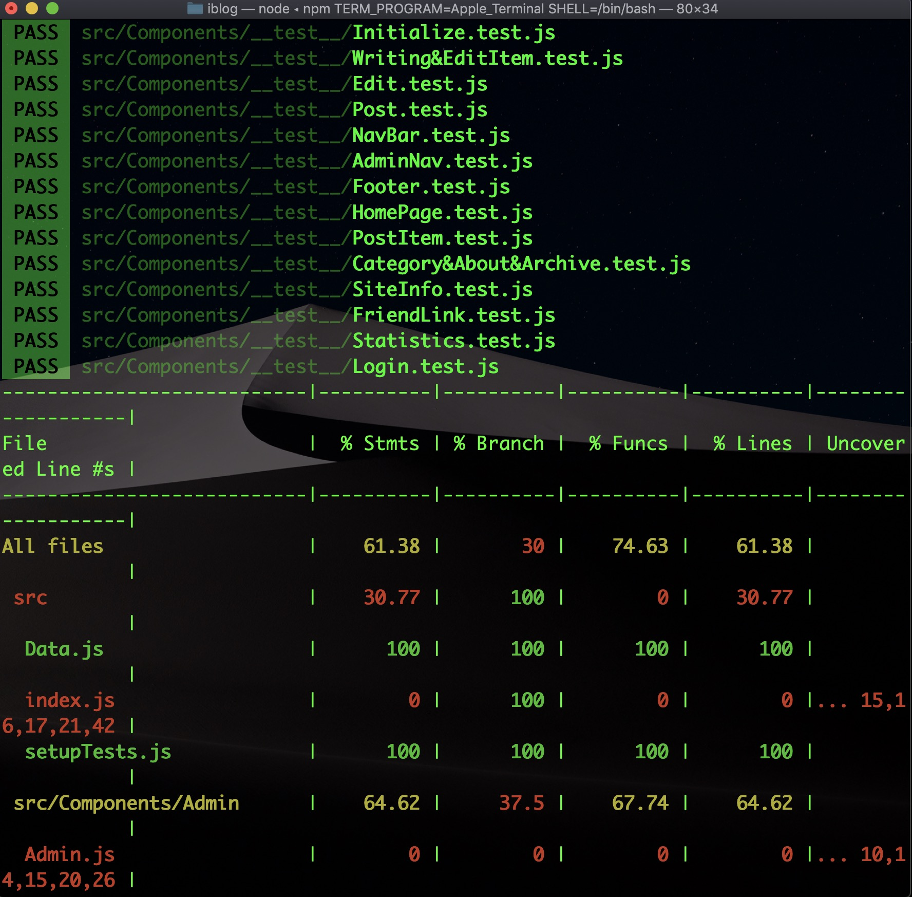
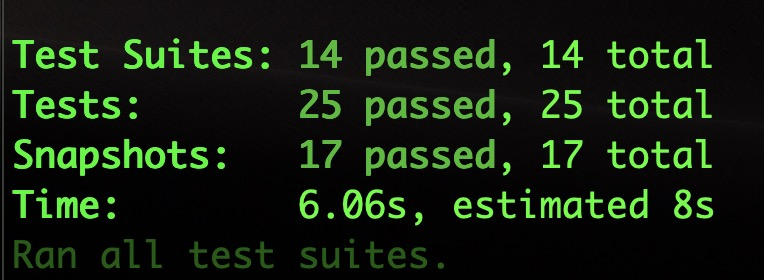

# iblog

该博客系统采用bootstrap+react开发，前端的大部分功能已经完成，接口在根目录下的API中

安装步骤如下：

* 安装node环境
* 克隆
* 进入文件目录
* `npm install`
* `npm start`

### 下面是预览图：

#### 首页

### 归档

### 专题

### 关于

### 后台主页

### 写作/编辑

### 移动端效果

其它类似，仅展示主页

### 测试

测试采用的是Jest+Enzyme,下面是测试结果

## 如果喜欢请Star一下哟~